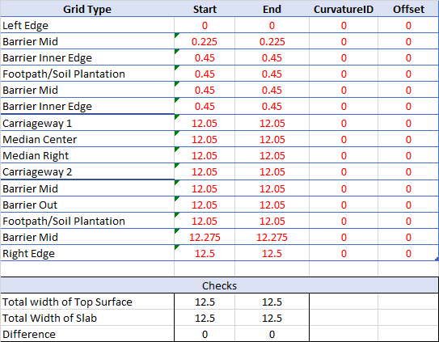

# Geometry

### Terminology

As per the image above, the grillage model is divided into 4 sides(Start-End,  Left-Right) as per the traffic direction.

For Coordinates, Origin is Set at B point. ==Axis are set as per the AutoCAD Default Coordinate system==. X increases from start to end of grillage and Y increases in the right to left direction.

For Girder and Diapharm are referred using its number.For example, Girder between point B and C is Girder 1, Diapharm between point D and I is Diapharm 3.

!!!tip
    All Inputs and direction or terminology are chosen such a way that it remains absolute.  This direction or Input units will not change with if you move or rotate grillage.

### Longitudinal Grid

Input for Longitudinal Grid is divided into 2 parts, Left longitudinal grid and Right longitudinal Grid.
As per [Figure][1] Points A,B,C,D,E represent Left Longitudinal Grid and Points F,G,H,I,J represent Right Logitudinal Grid.

[1]:#terminology

### Transverse Grid

### Topsurface Grid

