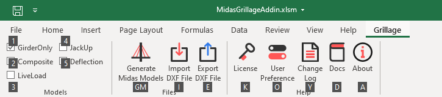

# Ribbon Tab

### Grillage Tab 

- Grillage Tab Automatically Activated when the user will open the Grillage Add-in Excel Sheet.

- This tab won’t be activated with any other excel sheet.

### Keyboard Shortcuts 

- Users can use `ALT+G` keyboard shortcut to access this tab.

- To use Specific command, for example: to see Changelog use `ALT+G+K`

### Models

This group includes a checkbox for each model to be generated. the program will only generate a model if it is selected.

- GirderOnly: Model with Girder only properties for the main girder with all Dead loads.
- Composite: This model is the same as the GirderOnly Model. The only change is that the main girder includes composite property.
- LiveLoad: This model is the same as the Composite model with moving loads. Dead loads are not included.
- JackUp: This model is Also Copy of Composite Model only Change is Support Locations.
- Deflection: Composite model with Elasticity modified for deflection check.

!!! tip
    Setting for selected Model will be saved in the Excel Sheet: Settings worksheet. This Setting is Specific to each Excel Sheet.

### Files

#### Generate STAAD Models 

-  Functions :
    - Generate STAAD Model for Selected Model
    - Option to Enable/Disable Loads for Each Model
    - Option to Modify Load Combination for Each Model
- Default Unit : Ton,Meter
- Keyboard Shortcut : `ALT+G+G+M`

!!! warning
    When you Generate New Model Program will Overwrite Existing Models. So, If you want to save Old Model Change Name of Folder(Save All Models) or Change Name of STAAD Model(Save Specific Model).

#### Import DXF File

- Functions : 
    - Extract Curvature points from AutoCAD DXF File
    - Option to Extract Curvature Points from Specific Layer
    - Option to Extract Curvature from Multiple Drawings.
- Default Unit: mm
- Keyboard Shortcut: `ALT+G+I`

!!! warning
    Before Importing AutoCAD DXF File Make Sure that All Curature Are in Sepetate Layer(only one Curvature per Layer). If you Keep two Curvature in Single-layer than the Program will create Single Curvature from all Curvature Points.

#### Export DXF File

- Functions : 
    - Export Grillage Geometry to AutoCAD DXF File.
- Default Unit : mm
- Keyboard Shortcut : `ALT+G+E`

### Help

#### License

- Functions : 
    - Activate License Key for Add-in
- Keyboard Shortcut : `ALT+G+K`

#### User Preference

- Functions : 
    - Settings for Grillage Add-in
    - This setting will affect all Excel Sheets
    - Document Customization Option to Link or Unlink Add-in with Excel Sheet
- Keyboard Shortcut: `ALT+G+O`

!!! info
    Application Level Settings vs Document Level Settings

    - **Application Level Settings**(User Preference) settings will Affect All Excel Sheets which are connected to Grillage Add-in.
    - **Document Level Settings** (Settings Worksheet)are specific to that Particular Excel Sheet.

    

#### Changelog

- Functions : 
    - Show Changes, Fix or Added Features with each version of Add-in
    - Also Shows Upcoming Changes or Features
- Keyboard Shortcut: `ALT+G+Y`

#### Docs

- Functions : 
    - Online Documentation for Project
- Keyboard Shortcut : `ALT+G+D`

!!! info
    Documentation for All Nodes Automations Software is Hosted online. This Site is also Mobile Compatible. This means you can  Open This Documentation on mobile. Scan this [QR Code][1] to Open this on Mobile. You can Also Download this Website for Offline Use using this [Link][2].

[1]:../links.md#qr-code
[2]:../links.md#website-for-offline-use

#### About

- Functions : 
    - Shows Add-in Product Name and Version Info
    - Include Contact Info and Copywrite Details
- Keyboard Shortcut : `ALT+G+A`