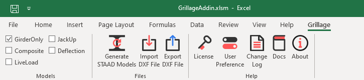

# Getting Started

### Requirements

**Software's Required:** 

- Excel 2007 or Later
- STAAD Pro
- AutoCAD, ZwCAD

**Prerequisites**:

   - .NET Framework 4.7.2 :  [Download][1]
   - VSTO runtime : [Download][2]

[1]:https://dotnet.microsoft.com/download/dotnet-framework
[2]:https://www.microsoft.com/en-us/download/details.aspx?id=48217

### Downloads

- STAAD Grillage Add-in : [Download][3]

[3]:https://nodesauto-my.sharepoint.com/:f:/g/personal/vivek_nodesautomations_com/Es_KSdrIeXZLiNUSp1RvqMoB2TUMYGXiV-UTZKQ5AuXgyg?e=CjkHd2

### Installation

**Steps**

- Check if You have required Software's
- Install Prerequisites
- Install STAAD Grillage Add-in
- Open Excel Sheet Created on Desktop  and Install License

!!! note  "Note"
	For More Detail instructions or Step By Step Guide follow this [Link][4]

[4]:https://nodesautomations.github.io/setup/installation.html

### Generate Your First Model

Open Grillage Add-in Excel Sheet. If you on the Trial license will prompt you to install a license just click on continue evaluation to keep using Trial.

Now when you install Grillage Add-in it will automatically install Grillage Tab in your Excel Ribbon.

To Create Your First Model just Select the model from the Models group and Click on Generate STAAD Models. This will create **GrillageAddin_Models** Folder where your Excel Sheet is Located. This folder includes all generated models.

Congratulations!!! 🎉👏              
You have just created your Grillage model with Properties and Loading in Single Click.

!!! tip
    Just Explore Generated STAAD Models for better understanding.
    Try to change a few variables in Excel Sheet and observe changes in STAAD Models.