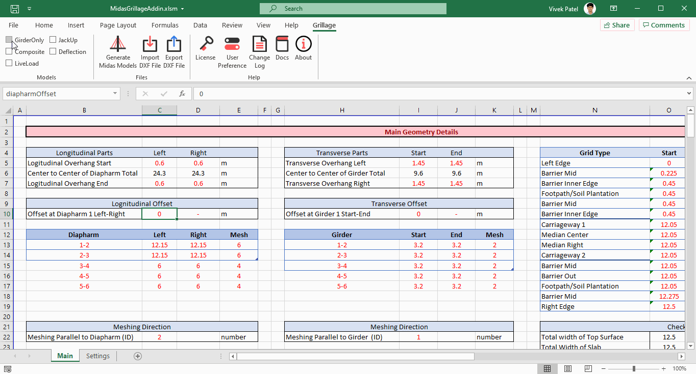

# Midas Grillage Add-in

### Overview

It is Excel Add-in to Generate Grillage Model for Midas Civil .

Midas Grillage Add-in can Generate Grillage Model as per User Input for any geometry or size using `*.mct` Midas Command File. The program uses Excel As an input Sheet so the user can Easily modify formula or change cell links. The user has Complete Control over Geometry, Meshing, Section, Supports, Loading, as well as Nodes for Results Extraction.

### **Features**

- Generate Grillage of Any Size, any number of Main or Cross Girder
- Generate Grillage in Curvature with or without skew
- User Define Meshing and Nodes
- Automatic Property & Load Assignment
- Moving Load Generation
- Load Combination Generation
- Generate Multiple Model (Girder only, Composite, Live Load, Jack Up) in Single Click

### Midas Civil Grillage Add-in Demo

#### User Interface

#### Generated Models

